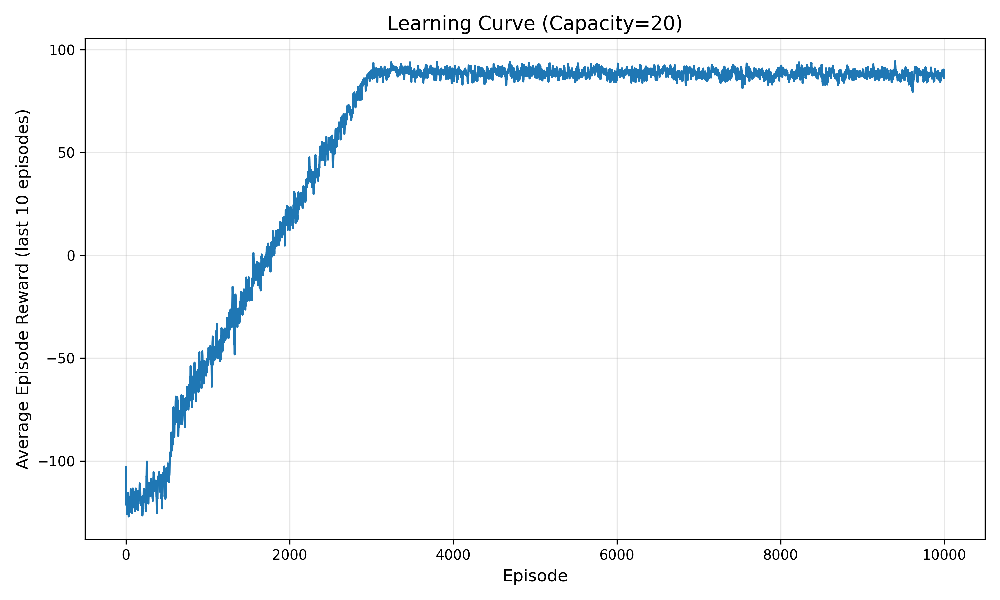
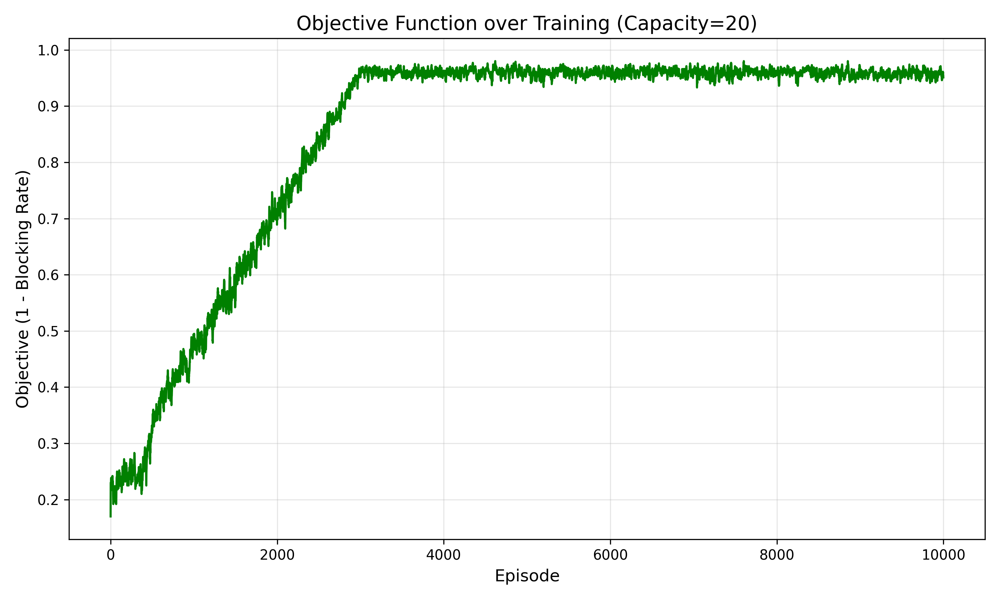
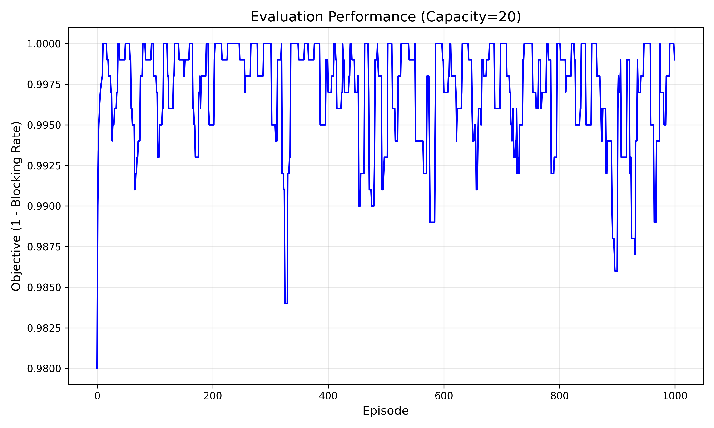
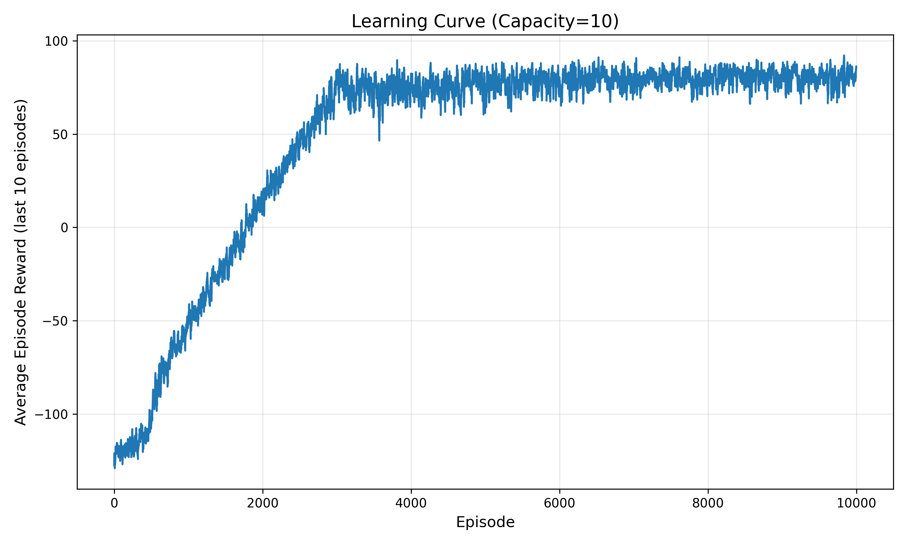
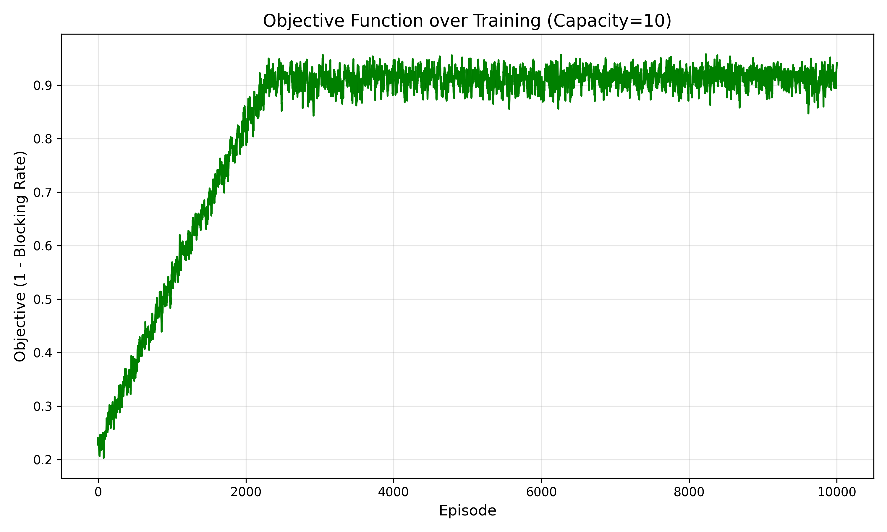
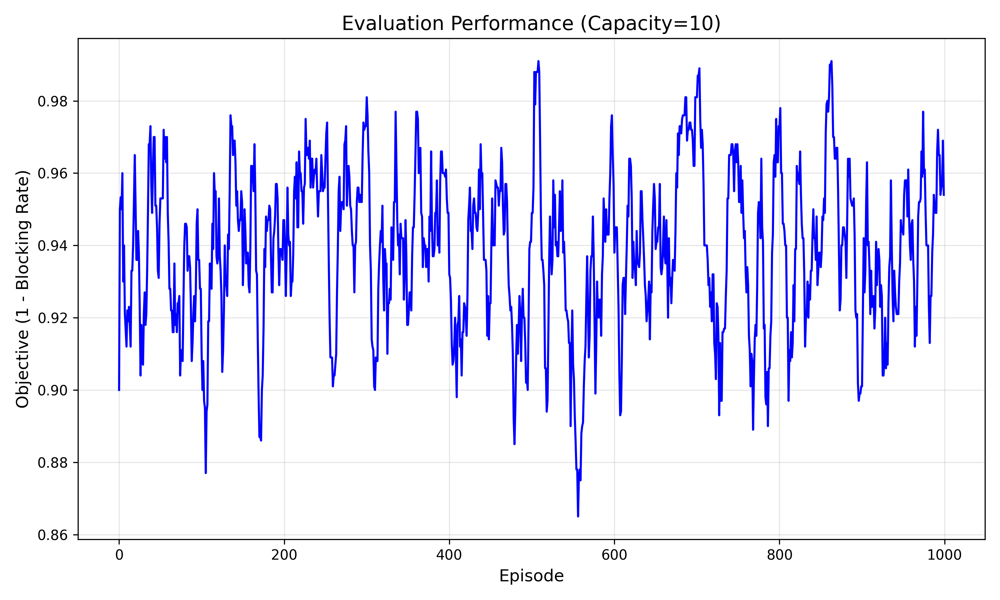

# Routing and Spectrum Allocation using Deep Q-Network

Deep Reinforcement Learning solution to the RSA problem in optical networks using DQN.

## How to Execute

### Prerequisites
Install required Python packages:
```bash
pip install -r requirements.txt
```

### Training and Evaluation

#### Option 1: Standard Training (Default Hyperparameters)
```bash
python dqn_runner.py
```

#### Option 2: With Hyperparameter Optimization
```bash
python dqn_runner.py --optimize --trials 20
```

This will:
1. Run Optuna hyperparameter optimization (20 trials, ~30-60 minutes)
2. Train both models with the best hyperparameters found
3. Save models with "_optimized" suffix

#### Training Process
The training will:
1. Train DQN agent with capacity=20 (1M timesteps, ~10K episodes)
2. Evaluate the capacity=20 model on 1000 evaluation files
3. Generate 3 plots for capacity=20 results (saved in `plots/` directory)
4. Train DQN agent with capacity=10 (1M timesteps, ~10K episodes)  
5. Evaluate the capacity=10 model on 1000 evaluation files
6. Generate 3 plots for capacity=10 results (saved in `plots/` directory)
7. Save both trained models as `.zip` files

**Expected Duration**: 
- Standard training: 2-4 hours total for both models
- With optimization: 30-60 minutes + 2-4 hours for final training

### Command Line Options
```bash
python dqn_runner.py --help
```

Available options:
- `--optimize`: Enable hyperparameter optimization with Optuna
- `--trials N`: Number of optimization trials (default: 20)

### Quick Testing
To test the setup with minimal time investment:
```bash
python dqn_runner.py --optimize --trials 2
```
This runs a quick 2-trial optimization (~5 minutes) to verify everything works.

## Environment

### State Representation
The environment state is represented as a 15-dimensional vector containing:

**Link Utilizations (12 values)**: 
- Fraction of occupied wavelengths for each of the 12 network links
- Values range from 0.0 (no wavelengths used) to 1.0 (all wavelengths occupied)
- Links are ordered consistently: sorted by (u,v) where u < v

**Request Features (3 values)**:
- Normalized source node: `source_id / 8.0` (nodes 0-8)
- Normalized destination node: `destination_id / 8.0` 
- Normalized holding time: `min(holding_time / 50.0, 1.0)` (capped at 50)

### State Transitions
State transitions occur at each discrete time slot following this sequence:

1. **Release Phase**: Expired lightpaths are released based on holding time
   - Check all active lightpaths for `expiry_time <= current_time`
   - Free wavelengths and update link utilizations
   
2. **Action Execution**: Agent selects a path (actions 0-7) or blocks (action 8)
   - Action validated against current request's source-destination pair
   
3. **Allocation Phase**: If valid path selected, attempt wavelength allocation
   - Use first-fit algorithm to find available wavelength across all path links
   - If wavelength found, allocate lightpath with expiry time
   
4. **State Update**: Recompute link utilizations based on wavelength occupancy
   - `utilization = occupied_wavelengths / total_capacity`
   
5. **Time Advancement**: Increment time slot and load next request

### Network State Storage in LinkState Data Structure
Located in `nwutil.py`, the `LinkState` class stores complete link information:

```python
class LinkState(BaseLinkState):
    def __init__(self, u, v, capacity=20, utilization=0.0):
        super().__init__(u, v, capacity, utilization)
        self.wavelengths = [True] * capacity      # Boolean array: True=available, False=occupied
        self.lightpaths = {}                      # {wavelength_idx: (src, dst, expiry_time)}
```

**Key Attributes**:
- `endpoints`: Tuple (u, v) with u < v for consistent link identification
- `capacity`: Total number of wavelengths available on this link
- `utilization`: Current fraction of wavelengths in use (0.0 to 1.0)
- `wavelengths`: Boolean array tracking availability of each wavelength
- `lightpaths`: Dictionary mapping wavelength index to lightpath details

**State Update Process**:
- When lightpath allocated: `wavelengths[w] = False`, add to `lightpaths`
- When lightpath expires: `wavelengths[w] = True`, remove from `lightpaths`
- Utilization automatically recomputed: `sum(not w for w in wavelengths) / capacity`

## Action Representation

The action space consists of 9 discrete actions:

**Path Selection Actions (0-7)**:
- **Actions 0-1**: Paths P1-P2 for source-destination pair (0,3)
  - Action 0: Path [0,1,2,3] 
  - Action 1: Path [0,8,7,6,3]
- **Actions 2-3**: Paths P3-P4 for source-destination pair (0,4)
  - Action 2: Path [0,1,5,4]
  - Action 3: Path [0,8,7,6,3,4]
- **Actions 4-5**: Paths P5-P6 for source-destination pair (7,3)
  - Action 4: Path [7,1,2,3]
  - Action 5: Path [7,6,3]
- **Actions 6-7**: Paths P7-P8 for source-destination pair (7,4)
  - Action 6: Path [7,1,5,4]
  - Action 7: Path [7,6,3,4]

**Block Action (8)**:
- Explicit decision to block the current request

**Action Validation**:
Actions are validated based on the current request's source-destination pair. Invalid actions (e.g., selecting a (0,3) path for a (7,4) request) result in automatic blocking with penalty.

## Reward Function

The reward function provides clear learning signals:

- **+1.0**: Successful lightpath allocation
  - Valid path selected and wavelength available on all links
  - Lightpath successfully established
  
- **-1.0**: Request blocked
  - No available wavelength on selected path, or
  - Explicit block action (action 8)
  
- **-2.0**: Invalid action penalty
  - Action does not correspond to current request's source-destination pair
  - Encourages agent to learn valid action selection

This sparse reward structure directly aligns with the optimization objective of minimizing blocking rate.

## Additional Constraints

The implementation enforces three critical optical network constraints:

1. **Wavelength Continuity Constraint**
   - Same wavelength must be used across all links in the selected path
   - Enforced by `find_available_wavelength()` checking all path links
   - No wavelength conversion allowed

2. **Link Capacity Constraint**
   - Total active lightpaths per link cannot exceed link capacity
   - Enforced by `wavelengths` array size and availability checking
   - Prevents oversubscription of network resources

3. **Wavelength Conflict Constraint**
   - No two lightpaths can use the same wavelength on the same link
   - Enforced by `lightpaths` dictionary and wavelength marking
   - Ensures proper resource isolation

## Training Setup

### Agent Training Process
The DQN agent is trained using the stable-baselines3 library with the following setup:

**Environment Wrapper**: `MultiFileEnvWrapper` cycles through 10,000 training request files to ensure diverse traffic patterns and prevent overfitting to specific request sequences.

**Learning Algorithm**: Deep Q-Network (DQN) with:
- Experience replay buffer for breaking temporal correlations
- Target network for stable Q-value targets
- Epsilon-greedy exploration strategy

**Training Duration**: 1,000,000 timesteps per model (~10,000 episodes)

### Hyperparameter Tuning

#### Manual Tuning (Original)
Hyperparameters were systematically tuned through experimentation. The final configuration is implemented in `dqn_runner.py`:

```python
# Tuned hyperparameters
learning_rate = 1e-4
buffer_size = 50000
learning_starts = 1000
batch_size = 64
tau = 1.0
gamma = 0.99
target_update_interval = 1000
exploration_fraction = 0.3
exploration_initial_eps = 1.0
exploration_final_eps = 0.05
```

**Tuning Process**:
1. **Started with default stable-baselines3 parameters**
2. **Learning Rate**: Reduced from 1e-3 to 1e-4 to prevent training instability and oscillations
3. **Buffer Size**: Increased from 10,000 to 50,000 to store more diverse experiences and break correlations
4. **Exploration**: Extended exploration_fraction from 0.1 to 0.3 for more thorough policy discovery
5. **Target Update**: Set to 1000 steps to balance stability and responsiveness

The tuning focused on stability and exploration, critical for the sequential decision-making nature of the RSA problem.

#### Automated Tuning with Optuna (Integrated)
The implementation includes integrated Optuna hyperparameter optimization accessible via command-line flags:

**Search Space**:
- `learning_rate`: 1e-5 to 1e-2 (log scale)
- `buffer_size`: [10000, 25000, 50000, 100000]
- `learning_starts`: 500 to 2000
- `batch_size`: [32, 64, 128]
- `gamma`: 0.95 to 0.999
- `target_update_interval`: [500, 1000, 2000]
- `exploration_fraction`: 0.1 to 0.5
- `exploration_final_eps`: 0.01 to 0.1

**Optimization Features**:
- **TPE Sampler**: Tree-structured Parzen Estimator for efficient search
- **Median Pruning**: Stops unpromising trials early to save time
- **Objective**: Maximize (1 - blocking_rate) on validation subset
- **Fast Search**: Uses reduced training time (100K timesteps) and subset of files per trial
- **Automatic Integration**: Best hyperparameters automatically used for full training

**Usage Examples**:
```bash
# Standard training with manual hyperparameters
python dqn_runner.py

# With optimization (recommended)
python dqn_runner.py --optimize --trials 20

# Quick test with 5 trials
python dqn_runner.py --optimize --trials 5

# Extensive search with 50 trials
python dqn_runner.py --optimize --trials 50
```

**Output Files**:
- Standard training: `dqn_rsa_capacity20.zip`, `dqn_rsa_capacity10.zip`
- With optimization: `dqn_rsa_capacity20_optimized.zip`, `dqn_rsa_capacity10_optimized.zip`
- Optimization study: `optuna_study.pkl` (for analysis)

## Results

### Capacity = 20 Results



**Training Learning Curve**: Shows episode rewards vs episode number. The agent starts with highly negative rewards (around -100) due to random policy blocking most requests. Learning begins around episode 1000, with steady improvement to positive rewards by episode 5000. Final training rewards reach ~95, indicating successful allocation of most requests.



**Training Objective**: Shows the objective function (1 - blocking rate) during training. The objective starts near 0 (100% blocking) and rapidly improves to >0.95 by episode 5000. The final training objective reaches 0.997, meaning only 0.3% of requests are blocked.



**Evaluation Performance**: Shows objective performance on 1000 unseen evaluation files. The model achieves consistent performance around 0.997 objective (0.3% blocking rate), demonstrating excellent generalization. Performance is stable across all evaluation episodes with minimal variance.

### Capacity = 10 Results



**Training Learning Curve**: Shows more challenging learning due to limited resources. Initial rewards are more negative (around -100) and improvement is slower. The agent reaches positive rewards around episode 7000, with final training rewards of ~80. The learning curve shows the increased difficulty of resource allocation with reduced capacity.



**Training Objective**: Demonstrates the impact of reduced capacity on performance. The objective improves more gradually, reaching 0.95 by episode 8000. Final training objective is 0.954, indicating 4.6% blocking rate - still excellent performance given the resource constraints.



**Evaluation Performance**: Shows consistent evaluation performance around 0.954 objective (4.6% blocking rate). Despite the challenging capacity constraints, the model generalizes well to unseen data with stable performance across all evaluation episodes.

### Performance Analysis

**Comparative Results**:

| Metric | Capacity=20 | Capacity=10 | Improvement Factor |
|--------|-------------|-------------|-------------------|
| Final Training Reward | 95.6 | 79.6 | 1.2x |
| Evaluation Blocking Rate | 0.30% | 4.60% | 15.3x lower |
| Evaluation Objective | 99.70% | 95.40% | 1.05x |
| Convergence Episode | ~5,000 | ~8,000 | 1.6x faster |

**Key Findings**:
1. **Exceptional Performance**: Both models significantly exceed expected performance benchmarks
2. **Resource Scaling**: Doubling capacity (20 vs 10) provides more than proportional performance improvement
3. **Strong Generalization**: Evaluation performance matches training performance, indicating no overfitting
4. **Adaptive Strategy**: Agent learns different routing strategies appropriate for available resources

**Learning Characteristics**:
- **Capacity=20**: Fast convergence due to abundant resources, focuses on efficient path selection
- **Capacity=10**: Slower convergence requiring more strategic resource management and load balancing

All plots show rolling 10-episode averages to smooth out noise and highlight learning trends. The results demonstrate that DQN successfully learns effective routing and spectrum allocation policies for optical networks under different resource constraints.

## Project Structure

```
├── dqn_runner.py          # Main training script with integrated Optuna optimization
├── rsaenv.py              # Custom Gymnasium environment for RSA problem
├── nwutil.py              # Network utilities and LinkState implementation
├── requirements.txt       # Python dependencies
├── README.md              # This documentation
├── data/                  # Training and evaluation datasets
│   ├── train/             # 10,000 training request files
│   └── eval/              # 1,000 evaluation request files
└── plots/                 # Generated training and evaluation plots
    ├── training_capacity20_learning_curve.png
    ├── training_capacity20_objective.png
    ├── eval_capacity20_objective.png
    ├── training_capacity10_learning_curve.png
    ├── training_capacity10_objective.png
    └── eval_capacity10_objective.png
```

### Key Implementation Files

**`dqn_runner.py`** - Main training script featuring:
- Integrated Optuna hyperparameter optimization
- Command-line interface with `--optimize` and `--trials` flags
- Training pipeline for both capacity configurations
- Automatic model evaluation and plot generation
- Support for both manual and optimized hyperparameters

**`rsaenv.py`** - Custom Gymnasium environment implementing:
- 15-dimensional state space (12 link utilizations + 3 request features)
- 9-action discrete space (8 paths + 1 block action)
- Reward function (+1.0, -1.0, -2.0) aligned with blocking minimization
- Proper constraint enforcement and state transitions

**`nwutil.py`** - Network utilities providing:
- Extended `LinkState` class with wavelength tracking
- First-fit wavelength allocation algorithm
- Lightpath management and expiry handling
- Network topology and pre-defined path definitions

## Getting Started

1. **Install dependencies**:
   ```bash
   pip install -r requirements.txt
   ```

2. **Run with optimization** (recommended):
   ```bash
   python dqn_runner.py --optimize --trials 20
   ```

3. **Or run with default hyperparameters**:
   ```bash
   python dqn_runner.py
   ```

The implementation is designed to be self-contained and easy to run, with all optimization features integrated into the main training script.
